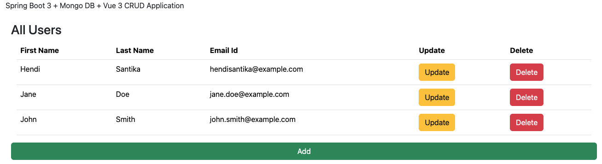

# springboot3-vue3-mongodb-crud

[](https://github.com/hendisantika/springboot3-vue3-mongodb-crud/actions/workflows/maven.yml)

Spring Boot 3 + Vue JS 3 + MongoDB CRUD

A simple full-stack CRUD application for managing users, with a Spring Boot REST API backend
backed by MongoDB and a Vue 3 single-page application frontend.

## Screenshot



## Tech Stack

- **Backend**: Spring Boot 4.1, Spring Data MongoDB, Lombok, Java 25
- **Frontend**: Vue 3, Vue Router, Axios, Bootstrap 5, Vite
- **Database**: MongoDB
- **CI**: GitHub Actions ([Maven build](.github/workflows/maven.yml))

## Prerequisites

- JDK 25
- Node.js 22+ and npm
- MongoDB running locally on the default port (`27017`)

## Getting Started

### Backend

```sh
cd backend
./mvnw spring-boot:run
```

The API starts on `http://localhost:8081` and connects to a MongoDB database named `userdb`
(configurable in `backend/src/main/resources/application.properties`).

### Frontend

```sh
cd frontend
npm install
npm run dev
```

The frontend dev server prints the local URL to open in your browser (Vite's default is
`http://localhost:5173`).

## Building

```sh
# Backend
cd backend && ./mvnw clean package

# Frontend
cd frontend && npm run build
```

## License

See [LICENSE](LICENSE).
